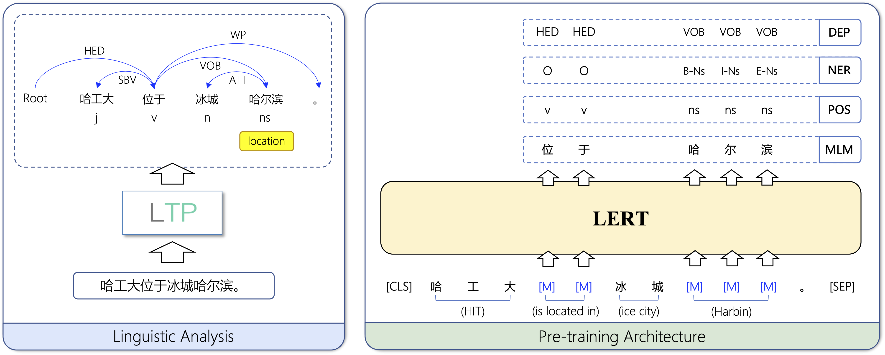

[**中文**](https://github.com/ymcui/LERT) | [**English**](https://github.com/ymcui/LERT/blob/main/README_EN.md)

<p align="center">
    <br>
    
    <br>
</p>
<p align="center">
    <a href="https://github.com/ymcui/LERT/blob/main/LICENSE">
        
    </a>
</p>
通常认为预训练语言模型（Pre-trained Language Model, PLM）已经能够从海量文本中自动学习语言学知识。为了验证通过显式注入语言学知识预训练模型能否获得进一步性能提升，在本项目中哈工大讯飞联合实验室（HFL）提出了一种<b>语言学信息增强的预训练模型LERT</b> ，融合了多种语言学知识。大量实验结果表明，在同等训练数据规模下，LERT能够带来显著性能提升。LERT相关资源将陆续开源，以供学术研究参考。   

- **LERT: A Linguistically-motivated Pre-trained Language Model**
- *Yiming Cui, Wanxiang Che, Shijin Wang, Ting Liu*
- 论文地址：https://arxiv.org/abs/2211.05344

----

[中文LERT](https://github.com/ymcui/LERT) | [中英文PERT](https://github.com/ymcui/PERT) | [中文MacBERT](https://github.com/ymcui/MacBERT) | [中文ELECTRA](https://github.com/ymcui/Chinese-ELECTRA) | [中文XLNet](https://github.com/ymcui/Chinese-XLNet) | [中文BERT](https://github.com/ymcui/Chinese-BERT-wwm) | [知识蒸馏工具TextBrewer](https://github.com/airaria/TextBrewer) | [模型裁剪工具TextPruner](https://github.com/airaria/TextPruner)

查看更多哈工大讯飞联合实验室（HFL）发布的资源：https://github.com/iflytek/HFL-Anthology

## 新闻
**2023/3/28 开源了中文LLaMA&Alpaca大模型，可快速在PC上部署体验，查看：https://github.com/ymcui/Chinese-LLaMA-Alpaca**

2022/11/25 微信公众号解读发布：[查看新闻](https://mp.weixin.qq.com/s?__biz=MzU2NDQ3MTQ0MA==&mid=2247488472&idx=1&sn=f22ccb81bc97626b548be0bf208206ac&chksm=fc4b2027cb3ca931075e9730753a2f207a7091c24f6f06e72c6e63ac1c4fb41b7faf249eaf12&token=425975098&lang=zh_CN#rd)

<b>2022/11/11 本项目相关的论文已在arXiv预印本上线，地址：https://arxiv.org/abs/2211.05344 </b>

2022/10/26 模型下载链接、基线系统效果已更新，欢迎提前下载使用。其余信息待补充。

2022/10/18 感谢各位的关注，本项目在逐渐完善内容中。

## 内容导引
| 章节                                  | 描述                                                         |
| ------------------------------------- | ------------------------------------------------------------ |
| [简介](#简介)                         | LERT预训练模型的基本原理                                       |
| [模型下载](#模型下载)         | LERT预训练模型的下载地址                               |
| [快速加载](#快速加载)                 | 如何使用[🤗Transformers](https://github.com/huggingface/transformers)快速加载模型 |
| [基线系统效果](#基线系统效果) | 中文NLU任务上的基线系统效果                             |
| [FAQ](#FAQ)                           | 常见问题答疑                                                 |
| [引用](#引用)                         | 本项目的技术报告                                          |


## 简介
预训练语言模型（PLM）已经成为自然语言处理领域的一个代表性基础模型（Foundation Model）。大多数预训练模型都是在文本的表面形式上执行语言学无关的预训练任务，如掩码语言模型（MLM）。为了进一步赋予预训练模型以更丰富的语言特征，在本文中，我们旨在提出一种简单而有效的方法将语言学特征融入预训练语言模型。我们提出**语言学信息增强的预训练模型LERT**。LERT除了使用掩码语言模型来进行预训练之外，还采用了3种语言学任务进行训练。为了更好地学习语言学特征，在本文中我们提出了一种**语言学启发的预训练机制（LIP）**。 我们在十个中文自然语言理解任务进行了广泛的实验。实验结果表明，LERT相比各种可比基线带来明显的性能提升。此外，通过各种分析实验，进一步证明了LERT的有效性。

**主要贡献：**

- 我们提出一种融合了3种语言学特征的预训练模型LERT，并且使用了一种语言学启发的预训练机制。
- 在10个中文自然语言理解数据集上的大量实验表明LERT能够与可比预训练基线系统获得显著性能提升。
- 相关资源将对外公开以进一步促进相关研究。



## 模型下载

### TensorFlow 1.x版本（原版）

| 模型简称                           | 层数 | 隐层大小 |          注意力头          |         参数量        |                          百度盘下载                          |
| :--------------------------------- | :--: | :---------------------: | :--------: | :----------------------------------------------------------: | :----------------------------------------------------------: |
| **Chinese-LERT-large**        | 24 | 1024 |  16  |  ~325M  | [[TensorFlow]](https://pan.baidu.com/s/1pxsS3almc90DPvMXH6BMYQ?pwd=s82t)<br/>（密码：s82t） |
| **Chinese-LERT-base**         | 12 | 768 |  12  |  ~102M  | [[TensorFlow]](https://pan.baidu.com/s/1_yb1jCDJ4s2P8OrF_5E_Tg?pwd=9jgi)<br/>（密码：9jgi） |
| **Chinese-LERT-small** | 12 | 256 | 4 | ~15M | [[TensorFlow]](https://pan.baidu.com/s/1fBk3em8a5iCMwPLJEBq2pQ?pwd=4vuy)<br/>（密码：4vuy） |

相关说明：

- 这里主要提供TensorFlow 1.15版本的模型权重。如需PyTorch或者TensorFlow 2版本的模型，请看下一小节。
- TensorFlow开源模型包含**完整权重**，包括MLM-head、linguistic-heads等。
- 训练语料：中文维基百科，其他百科、新闻、问答等数据，总词数达5.4B，约占用20G磁盘空间，与MacBERT、PERT相同。  
- 参数量：仅统计transformer部分，不包含task head部分的参数量。

以TensorFlow版`Chinese-LERT-base`为例，下载完毕后对zip文件进行解压得到：

```
chinese_lert_base_L-12_H-768_A-12.zip
    |- lert_model.ckpt      # 模型权重
    |- lert_model.meta      # 模型meta信息
    |- lert_model.index     # 模型index信息
    |- lert_config.json     # 模型参数
    |- vocab.txt            # 词表（与谷歌原版一致）
```

### PyTorch以及TensorFlow 2版本 

| 模型简称 | 模型文件大小 | transformers模型库地址（支持MLM填空交互） |
| :------- | :---------: |  :---------- |
| **Chinese-LERT-large** | ~1.2G | https://huggingface.co/hfl/chinese-lert-large |
| **Chinese-LERT-base** | ~400M | https://huggingface.co/hfl/chinese-lert-base |
| **Chinese-LERT-small** | ~60M | https://huggingface.co/hfl/chinese-lert-small |

相关说明：

- 下载方法：点击任意需要下载的模型 → 选择"Files and versions"选项卡 → 下载对应的模型文件。
- 通过🤗transformers模型库可以下载TensorFlow (v2)和PyTorch版本模型。
- PyTorch开源版本包含MLM部分的权重，但**不包含linguistic heads**。

## 快速加载

由于LERT主体部分仍然是BERT结构，用户可以使用[transformers库](https://github.com/huggingface/transformers)轻松调用LERT模型。

**⚠️ 注意：本目录中的所有模型均使用BertTokenizer以及BertModel加载。**

```python
from transformers import BertTokenizer, BertModel
tokenizer = BertTokenizer.from_pretrained("MODEL_NAME")
model = BertModel.from_pretrained("MODEL_NAME")
```
其中`MODEL_NAME`对应列表如下：

| 模型名                 | MODEL_NAME                 |
| ---------------------- | -------------------------- |
| Chinese-LERT-large     | hfl/chinese-lert-large     |
| Chinese-LERT-base      | hfl/chinese-lert-base      |
| Chinese-LERT-small | hfl/chinese-lert-small |

## 基线系统效果
论文中在以下10个任务上进行了效果测试。GitHub目录中仅显示其中一部分，完整结果请参考论文。

| 任务类别         | 数据集                                                       |
| ---------------- | ------------------------------------------------------------ |
| 抽取式阅读理解   | [CMRC 2018（简体中文）](https://github.com/ymcui/cmrc2018)、[DRCD（繁体中文）](https://github.com/DRCKnowledgeTeam/DRCD) |
| 文本分类（单句） | [ChnSentiCorp](https://github.com/pengming617/bert_classification)、[TNEWS](https://github.com/CLUEbenchmark/CLUE) |
| 文本分类（句对） | [XNLI](https://github.com/google-research/bert/blob/master/multilingual.md)、[LCQMC](http://icrc.hitsz.edu.cn/info/1037/1146.htm)、[BQ Corpus](http://icrc.hitsz.edu.cn/Article/show/175.html)、[OCNLI](https://github.com/CLUEbenchmark/OCNLI) |
| 命名实体识别     | [MSRA-NER](https://github.com/ProHiryu/bert-chinese-ner)、[People's Daily（人民日报）](https://github.com/ProHiryu/bert-chinese-ner) |

实验结果表格中，

1. 括号外为多次finetune最大值，括号内为平均值。
2. 除*BERT*（即谷歌原版BERT-base）模型外，其余模型均使用同等数据量进行训练。
3. RoBERTa-base和RoBERTa-large分别指[`RoBERTa-wwm-ext`和`RoBERTa-wwm-ext-large`](https://github.com/ymcui/Chinese-BERT-wwm)。

### 阅读理解（CMRC 2018）

[**CMRC 2018数据集**](https://github.com/ymcui/cmrc2018)是哈工大讯飞联合实验室发布的中文机器阅读理解数据（抽取式），形式与SQuAD相同。（评价指标：EM / F1）

| 模型 | 开发集 | 测试集 | 挑战集 |
| :------- | :---------: | :---------: | :---------: |
| **↓ 以下为base模型** ||||
| BERT | 65.5 (64.4) / 84.5 (84.0) | 70.0 (68.7) / 87.0 (86.3) | 18.6 (17.0) / 43.3 (41.3) |
| BERT-wwm-ext | 67.1 (65.6) / 85.7 (85.0) | 71.4 (70.0) / 87.7 (87.0) | 24.0 (20.0) / 47.3 (44.6) |
| RoBERTa-base | 67.4 (66.5) / 87.2 (86.5) | 72.6 (71.4) / 89.4 (88.8) | 26.2 (24.6) / 51.0 (49.1) |
| MacBERT-base|68.5 (67.3) / 87.9 (87.1)|73.2 (72.4) / 89.5 (89.2)|**30.2** (26.4) / 54.0 (52.2)|
| PERT-base |68.5 (68.1) / 87.2 (87.1)|72.8 (72.5) / 89.2 (89.0)|28.7 (**28.2**) / 55.4 (53.7)|
| **LERT-base** |**69.2 (68.4) / 88.1 (87.9)**|**73.5 (72.8) / 89.7 (89.4)**|27.7 (26.7) / **55.9 (54.6)**|
| **↓ 以下为large模型** ||||
| RoBERTa-large | 68.5 (67.6) / 88.4 (87.9) | 74.2 (72.4) / 90.6 (90.0) | 31.5 (30.1) / 60.1 (57.5) |
| MacBERT-large |70.7 (68.6) / 88.9 (88.2)|74.8 (73.2) / 90.7 (90.1)|31.9 (29.6) / 60.2 (57.6)|
| PERT-large |**72.2 (71.0)** / 89.4 (88.8)|**76.8 (75.5)** / 90.7 (90.4)|**32.3 (30.9)** / 59.2 (58.1)|
| **LERT-large** |71.2 (70.5) / **89.5 (89.1)**|75.6 (75.1) / **90.9 (90.6)**|32.3 (29.7) / **61.2 (59.2)**|


### 单句文本分类（ChnSentiCorp、TNEWS）

以下为情感分类数据集ChnSentiCorp和新闻分类数据集TNEWS结果。（评价指标：Acc）
| 模型 | ChnSentiCorp-开发集 | TNEWS-开发集 |
| :------- | :---------: | :---------: |
| **↓ 以下为base模型** |||
| BERT-wwm-ext | **95.4** (94.6) |57.0 (56.6)|
| RoBERTa-base | 94.9 (94.6) |57.4 (56.9)|
| MacBERT-base|95.2 (**94.8**)|57.4 (**57.1**)|
| PERT-base |94.0 (93.7)|56.7 (56.1)|
| **LERT-base** |94.9 (94.7)|**57.5 (57.1)**|
| **↓ 以下为large模型** |||
| RoBERTa-large | **95.8** (94.9) |58.8 (58.4)|
| MacBERT-large |95.7 (**95.0**)|**59.0 (58.8)**|
| PERT-large |94.5 (94.0)|57.4 (57.2)|
| **LERT-large** |95.6 (94.9)|58.7 (58.5)|

### 句对文本分类（XNLI、OCNLI）

以下为自然语言推断XNLI和OCNLI数据集结果。（评价指标：Acc）

| 模型 | XNLI-开发集 | OCNLI-开发集 |
| :------- | :---------: | :---------: |
| **↓ 以下为base模型** |||
| BERT-wwm-ext | 79.4 (78.6) |76.0 (75.3)|
| RoBERTa-base | 80.0 (79.2) |76.5 (76.0)|
| MacBERT-base|**80.3 (79.7)**|77.0 (76.5)|
| PERT-base |78.8 (78.1)|75.3 (74.8)|
| **LERT-base** |80.2 (79.5)|**78.2 (77.5)**|
| **↓ 以下为large模型** |||
| RoBERTa-large | 82.1 (81.3) |78.5 (78.2)|
| MacBERT-large |**82.4 (81.8)**|79.0 (78.7)|
| PERT-large |81.0 (80.4)|78.1 (77.8)|
| **LERT-large** |81.7 (81.2)|**79.4 (78.9)**|

### 命名实体识别（MSRA、PD）

以下为MSRA（测试集）和人民日报数据集（开发集）结果。（评价指标：F值）

| 模型 | MSRA-测试集 | PD-开发集 |
| :------- | :---------: | :---------: |
| **↓ 以下为base模型** |||
| BERT-wwm-ext | 95.3 (94.9) |95.3 (95.1)|
| RoBERTa-base | 95.5 (95.1) |95.1 (94.9)|
| MacBERT-base|95.3 (95.1)|95.2 (94.9)|
| PERT-base |95.6 (95.3)|95.3 (95.1)|
| **LERT-base** |**95.7 (95.4)**|**95.6 (95.4)**|
| **↓ 以下为large模型** |||
| RoBERTa-large | 95.5 (95.5) |95.7 (95.4)|
| MacBERT-large |96.2 (95.9)|95.8 (95.7)|
| PERT-large |96.2 (96.0)|96.1 (95.8)|
| **LERT-large** |**96.3 (96.0)**|**96.3 (96.0)**|


### 小模型效果
| 模型 | CMRC 2018 | DRCD | XNLI | LCQMC | BQ | CSC | 参数量 |
| :------- | :---------: | :---------: | :---------: | :---------: | :---------: | :---------: | :---------: |
| RBT3 | 62.2 / 81.8 | 75.0 / 83.9 | 72.3 | 85.1 | 83.3 | 92.8 | 38M |
| ELECTRA-small |67.8 / 83.4|79.0 / 85.8|73.1|85.9|82.0|94.3|12M|
| ELECTRA-small (180G) |68.5 / 85.2|82.9 / 88.7|74.6|85.8|82.1|93.6|12M|
| LERT-small |67.8 / 85.2|83.2 / 89.4|75.2|85.3|83.4|94.0|15M|

以上报告的是测试集上的效果，更多结果请查看论文。

## FAQ
**Q1：为什么PyTorch版本不包含linguistic heads?**  
A1：PyTorch版本模型由TF原版转换而来。为了可以直接使用bert相关接口读取LERT模型，PyTorch版本中只包含了Transformer+MLM部分的权重。如需完整版本的模型，请下载TF 1.x版本的模型。另外需要说明的是，如需直接在下游任务中使用或者二次预训练的话是不需要linguistic heads这部分权重的。

**Q2：有英文模型供下载吗？**  
A2：暂时无计划在英文上训练。

**Q3：配置文件、词表在哪里？**  
A3：见`src`目录，或下载对应的模型，压缩包内包含上述文件。

**Q4：模型可以进行MLM预测吗？**  
A4：可以。开放的权重包含完整的MLM权重。推荐使用huggingface在线互动demo体验：https://huggingface.co/hfl

**Q5：如何预测被mask的单词的POS/NER/DEP标签？**  
A5：见`src`目录。通过`run_pretraining.py`文件加载TF 1.15版权重（包含完整linguistic heads）即可进行语言学标签预测。每个语言学特征对应的特征列表请查看论文或`src`目录中给出的提示。

## 引用

如果本项目中的模型或者相关结论有助于您的研究，请引用以下文章：https://arxiv.org/abs/2211.05344

```
@article{cui2022lert,
      title={LERT: A Linguistically-motivated Pre-trained Language Model}, 
      author={Cui, Yiming and Che, Wanxiang and Wang, Shijin and Liu, Ting},
      year={2022},
      eprint={2211.05344},
      archivePrefix={arXiv},
      primaryClass={cs.CL}
}
```


## 关注我们
欢迎关注哈工大讯飞联合实验室官方微信公众号，了解最新的技术动态。


## 问题反馈
如有问题，请在GitHub Issue中提交。

- 在提交问题之前，请先查看FAQ能否解决问题，同时建议查阅以往的issue是否能解决你的问题。
- 重复以及与本项目无关的issue会被[stable-bot](stale · GitHub Marketplace)处理，敬请谅解。
- 我们会尽可能的解答你的问题，但无法保证你的问题一定会被解答。
- 礼貌地提出问题，构建和谐的讨论社区。
